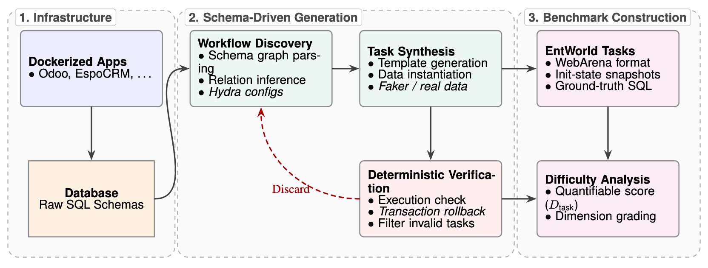
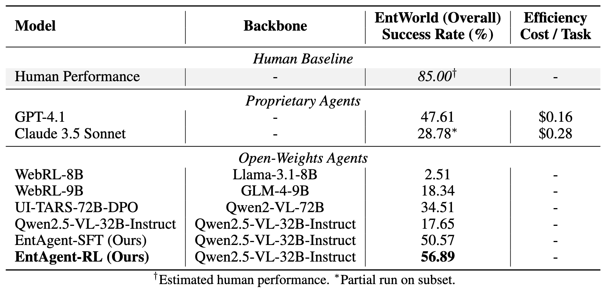

# EntWorld: A Holistic Environment and Benchmark for Verifiable Enterprise GUI Agents

<!-- [<a href=" ">Website</a >]  -->
[<a href="https://arxiv.org/abs/2601.17722">Paper</a >]

<i>EntWorld</i> is a realistic and diverse benchmark for enterprise systems, designed for evaluating multimodal autonomous language agents. It comprises a set of diverse tasks across 6 core business applications. It ensures reproducibility and executable evaluation. We propose a rigorous evaluation metric based on SQL state verification during dataset construction. By directly querying the underlying databases of the applications, EntWorld enables precise validation of task completion (e.g., verifying exact database record insertions or updates), ensuring deterministic and noise-free evaluation. This eliminates ambiguities in visual matching and enables high-precision correctness assessment.



Here are the scores on the test set results of EntWorld. All metrics are task Success Rate (SR). 

<!-- ## TODOs -->
<!-- - [x] Add human trajectories.
- [x] Add GPT-4V + SoM trajectories from our paper. -->
<!-- - [x] Add scripts for end-to-end training and reset of environments. -->
<!-- - [x] Add demo to run multimodal agents on any arbitrary webpage. -->
## Key Features
- **Multi-modal Support**: Integrated support for vision-based (SoM) and text-based (Accessibility Tree) observations.
- **Enterprise Ready**: Specialized for enterprise software interaction (CRM, ERP, Project Management).
- **Verifiable Results**: Automated correctness checking using advanced LLM-based verification.
- **Scalable Execution**: Concurrent process-based task distribution for high-throughput benchmarking.

## EntWorld Benchmark Construction
If you want to learn more about the construction of the EntWorld Benchmark, you can follow the instructions [here](benchmmark_construction/README_en.md) for details.

## Install
```bash
# Python 3.10 (or 3.11, but not 3.12 because 3.12 deprecated distutils which is needed here)
python -m venv venv
source venv/bin/activate
pip install -r requirements.txt
playwright install
pip install -e .
```

## Testing

You can run the unit tests to ensure that VEGA is installed correctly and the environment is properly configured:
```bash
pytest -v tests/
```

## End-to-end Evaluation

Project Structure
  - `src/vega/agent`: Core agent logic and prompt construction.
  - `src/vega/browser_env`: Playwright-based browser environment.
  - `src/vega/evaluation_harness`: Custom evaluators for benchmark tasks.
  - `src/vega/runner`: Orchestration pipeline for large-scale evaluation.
  - `src/vega/config.py`: Unified configuration management.

1\. Setup the standalone environments.
Please check out [this page](environment_docker/README.md) for details.

2\. Configure the URLs for each website.

```bash
export ESPOCRM='http://${SERVER}:9900'
export ZENTAO='http://${SERVER}:9901'
export OPENPROJECT='http://${SERVER}:9902'
export VEOPS_CMDB='http://${SERVER}:9903'
export ITOP='http://${SERVER}:9904'
export SNIPE_IT='http://${SERVER}:9907'
```

3\. Generate config files for each website test example:
Each website test example has a [config file](./config_files) in this environment, which is used for resetting, interacting, and evaluating. Before the formal evaluation, it is also necessary to verify the website login configuration. The operations are as follows:

Generate config files:
```bash
python scripts/generate_test_data.py
```

Obtain and save the auto-login cookies for all websites:
```bash
bash prepare.sh
```
The configurations in this work are implemented based on [WebArena](https://github.com/web-arena-x/webarena). You can refer to [this link](https://github.com/web-arena-x/webarena) for more details. You can also check [VisualAgentBench](https://github.com/THUDM/VisualAgentBench/tree/main/VAB-WebArena-Lite) to get the configurations.


4\. Launch the evaluation. For example, to reproduce our GPT-4.1 captioning baseline:
After configuring the test examples, you can run the agents for evaluations. In this evaluation, the trajectory will be saved in `<your_result_dir>/0.html` if desired. You can run the evaluation with the following script. You can also change the model to evaluate other baseline agents. 
```bash
python run.py --config local_config.yaml
```

You can configure the evaluation by modifying the `local_config.yaml` file. The configuration file allows you to specify the models to use, the sites to evaluate, and other settings. See `example_config.yaml` for a full list of available options.

### Agent Trajectories

We analyzed the data results and provided examples of both successes and failures. The following is a trajectory of an enterprise system web task, which displays the evaluation process. The agent's observations and output at each step are shown.


## Citation
If you find our environment or our models useful, please consider citing our work Entworld:
```
@misc{mo2026entworld,
      title={EntWorld: A Holistic Environment and Benchmark for Verifiable Enterprise GUI Agents}, 
      author={Ying Mo and Yu Bai and Dapeng Sun and Yuqian Shi and Yukai Miao and Li Chen and Dan Li},
      year={2026},
      eprint={2601.17722},
      archivePrefix={arXiv},
      primaryClass={cs.AI},
      url={https://arxiv.org/abs/2601.17722}, 
}
```