# 网站部署与初始化指南

本文档提供了框架支持的所有 Self-host 网站的部署和数据初始化步骤。每个网站都使用 Docker Compose 进行容器化部署，确保环境一致性和快速启动。

> **注意**: 请确保已安装 Docker 和 Docker Compose（v2+）

---

## VeOps CMDB

### 部署步骤

#### 1. 启动服务

进入 CMDB 目录并启动容器：

```bash
cd {$sites}/cmdb
docker compose up -d
```

#### 2. 验证部署

等待容器启动完成后，访问 Web 界面验证部署是否成功：

- **访问地址**: `http://localhost:9903`（根据实际配置调整）
- **验证方式**: 能够看到登录页面即表示部署成功

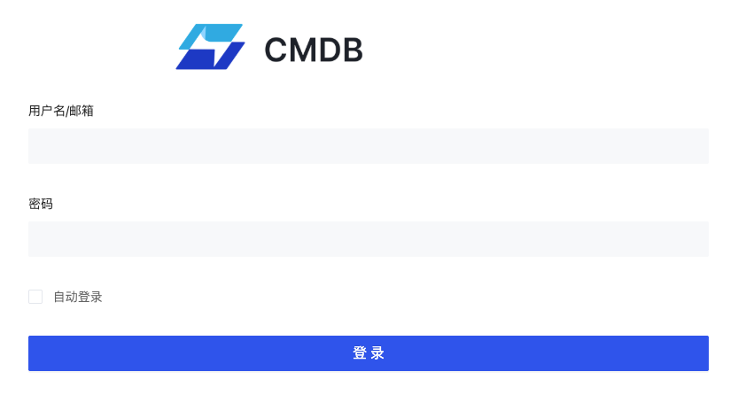

### 数据初始化

#### 1. 登录系统

使用默认账户登录：

- **用户名**: `demo`
- **密码**: `123456`

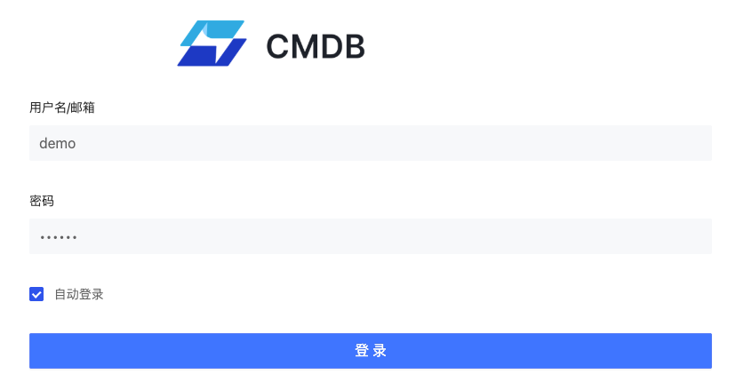

#### 2. 验证初始化

登录成功后，进入首页查看初始化数据，确认系统已正确初始化：

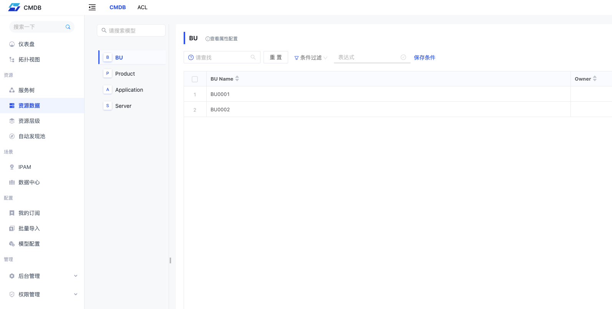

---

## iTop

### 部署步骤

#### 1. 启动服务

进入 iTop 目录并启动容器：

```bash
cd {$sites}/iTop
docker compose up -d
```

#### 2. 验证部署

等待容器启动完成后，访问 Web 界面验证部署是否成功：

- **访问地址**: `http://localhost:9904`（根据实际配置调整）
- **验证方式**: 能够看到安装向导页面即表示部署成功

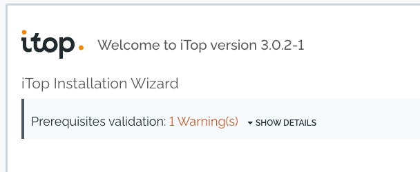

### 数据初始化

iTop 需要通过 Web 安装向导完成初始化配置，请按照以下步骤操作：

#### 1. 开始安装

点击 "Install a new iTop" 开始安装：

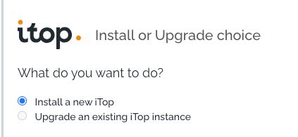

#### 2. 同意许可协议

阅读并同意 iTop 许可协议：

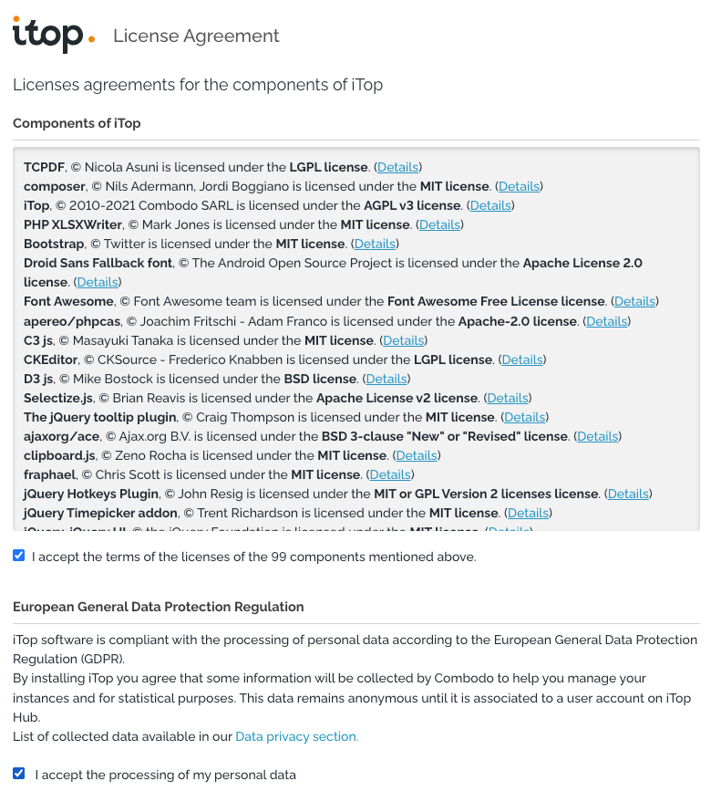

#### 3. 配置数据库连接

填写数据库连接信息：

- **Server Name**: `db`
- **Login**: `itop`
- **Password**: `It0pDbP@ss!`

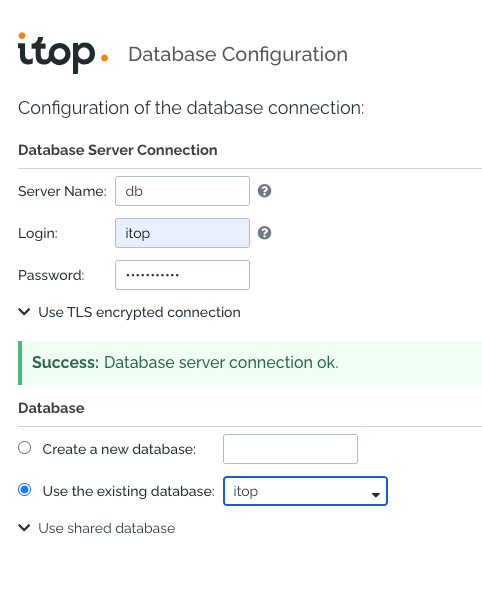

#### 4. 设置管理员账户

设置管理员账户密码：

- **密码**: `admin1234`

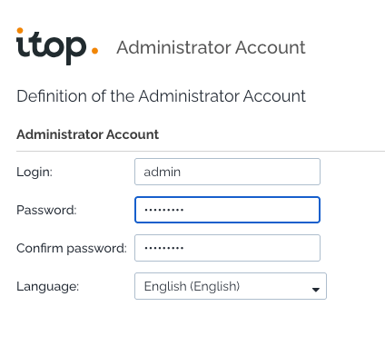

#### 5. 其他参数配置

保持默认配置或根据需要进行调整：

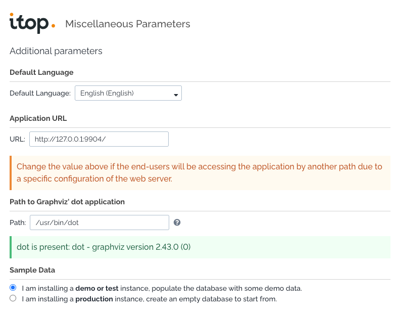

#### 6. 配置管理选项

选择配置管理相关功能模块：

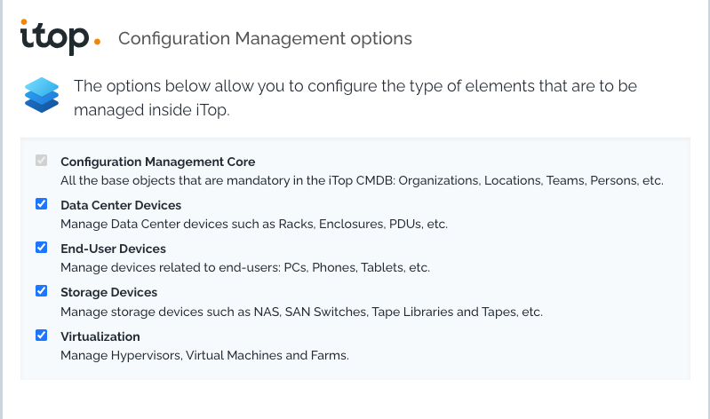

#### 7. 服务管理选项

选择服务管理相关功能模块：

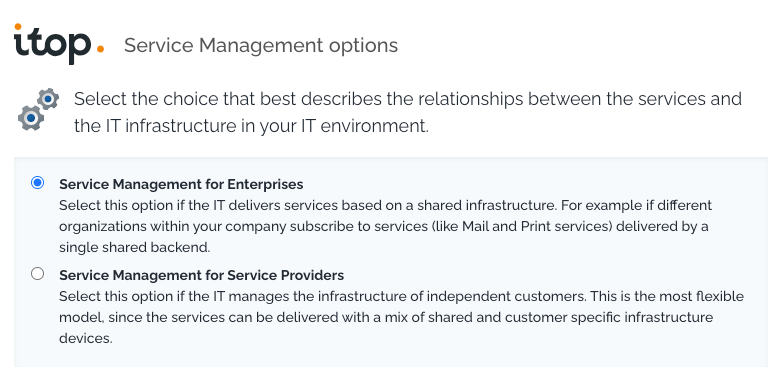

#### 8. 工单管理选项

选择工单管理相关功能模块：

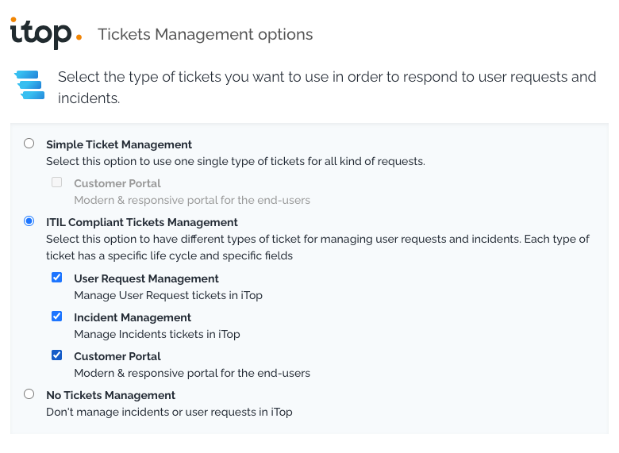

#### 9. 变更管理选项

选择变更管理相关功能模块：

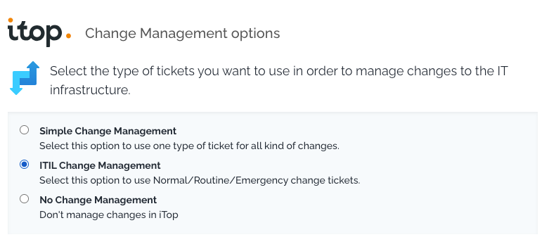

#### 10. ITIL 工单选项

选择额外的 ITIL 工单功能：

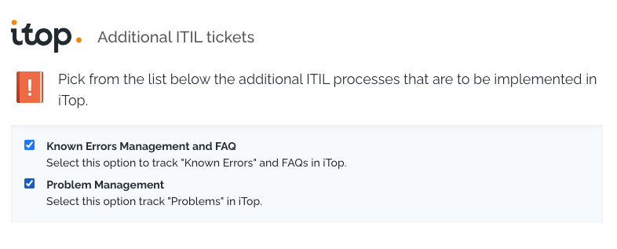

#### 11. 准备安装

确认所有配置信息，准备开始安装：

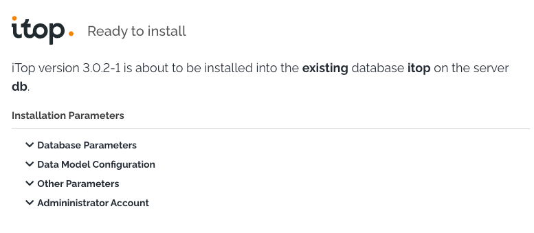

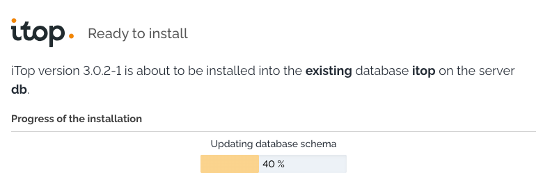

#### 12. 完成安装

等待安装完成后，系统会显示安装成功页面：


#### 13. 验证初始化

使用管理员账户登录系统，进入首页查看初始化数据，确认系统已正确初始化：

- **用户名**: `admin`
- **密码**: `admin1234`

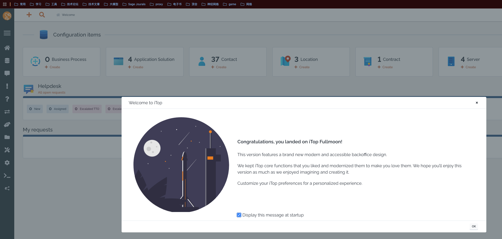

---

## OpenProject

### 部署步骤

#### 1. 启动服务

进入 OpenProject 目录并启动容器：

```bash
cd {$sites}/openproject
docker compose up -d
```

#### 2. 验证部署

等待容器启动完成后，访问 Web 界面验证部署是否成功：

- **访问地址**: `http://localhost:9902`（根据实际配置调整）
- **验证方式**: 能够看到登录页面即表示部署成功

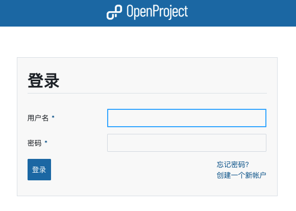

### 数据初始化

#### 1. 首次登录

使用默认管理员账户登录：

- **用户名**: `admin`
- **密码**: `admin`

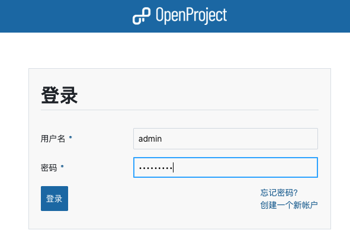

#### 2. 重置密码

首次登录后，系统会要求重置密码。设置新密码：

- **新密码**: `admin123456`

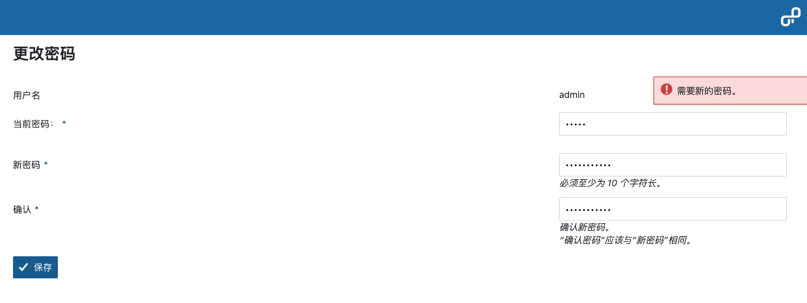

#### 3. 验证初始化

使用新密码登录后，进入首页查看初始化数据，确认系统已正确初始化：

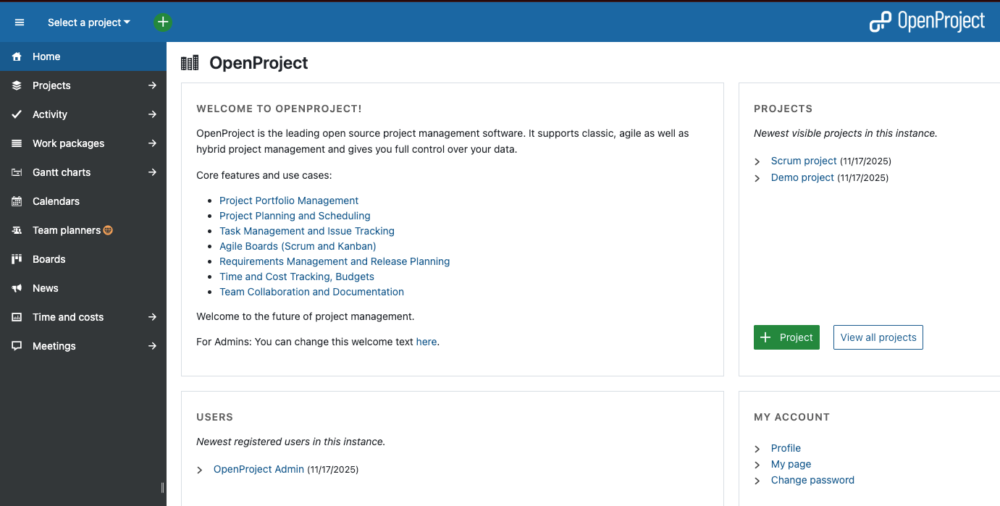

---

## ZenTao（禅道）

### 部署步骤

#### 1. 启动服务

进入 ZenTao 目录并启动容器：

```bash
cd {$sites}/zentao
docker compose up -d
```

#### 2. 验证部署

等待容器启动完成后，访问 Web 界面验证部署是否成功：

- **访问地址**: `http://localhost:9901`（根据实际配置调整）
- **验证方式**: 能够看到安装向导页面即表示部署成功

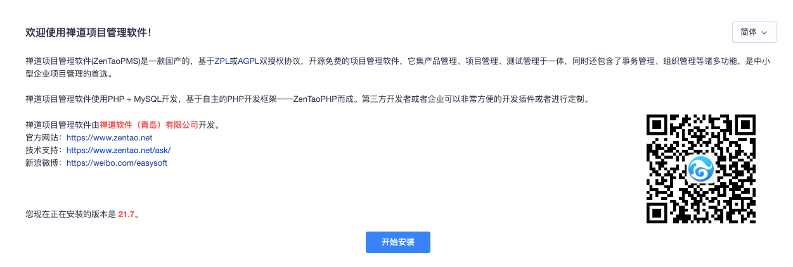

### 数据初始化

ZenTao 需要通过 Web 安装向导完成初始化配置，请按照以下步骤操作：

#### 1. 同意许可协议

阅读并同意 ZenTao 许可协议：

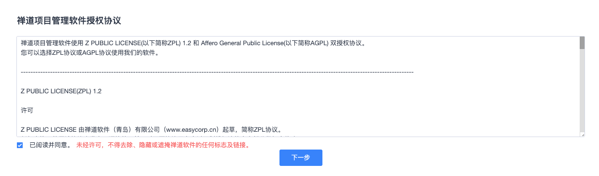

#### 2. 系统检测

系统会自动检测环境配置，默认点击"下一步"继续：

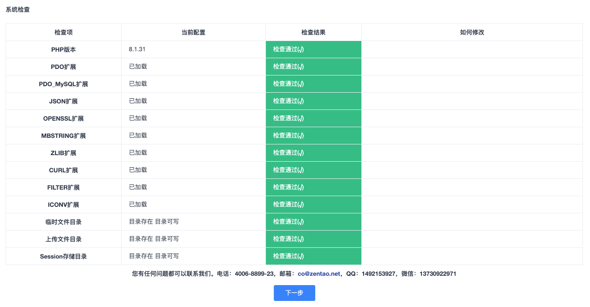

#### 3. 配置创建检测

系统会检测配置文件创建情况，默认点击"下一步"继续：

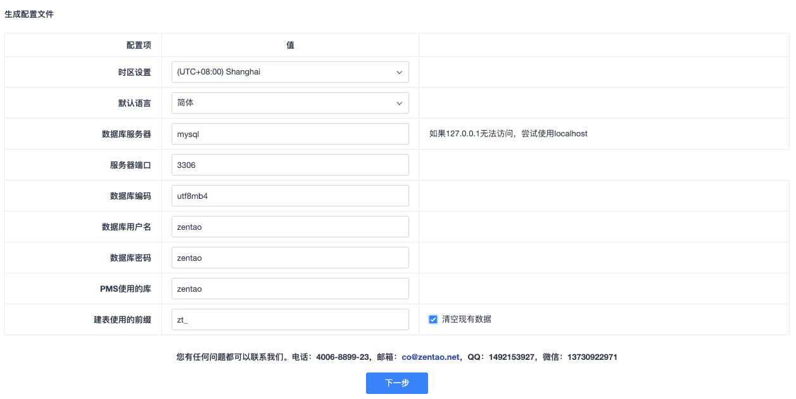

#### 4. 完成基础配置

基础配置完成后，点击"完成"进入下一步：

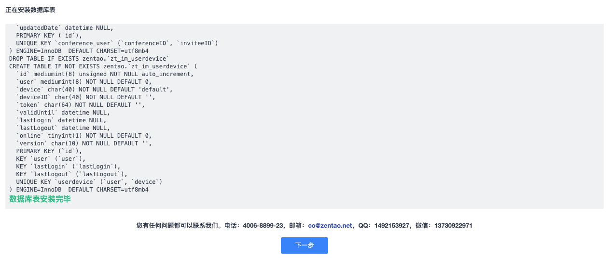

#### 5. 选择管理模式

选择"使用全生命周期管理模式"：

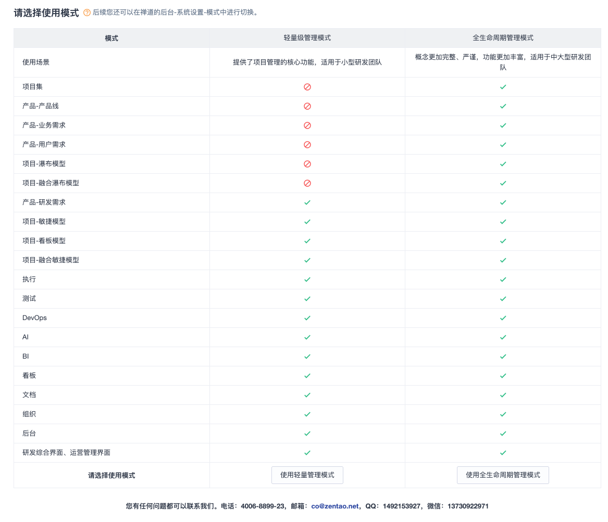

#### 6. 设置账户并导入 Demo 数据

在账户设置页面，**务必勾选"导入 demo 数据"**，以便后续评测使用：

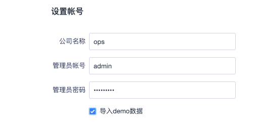

#### 7. 验证初始化

安装完成后，进入首页查看初始化数据，确认系统已正确初始化：

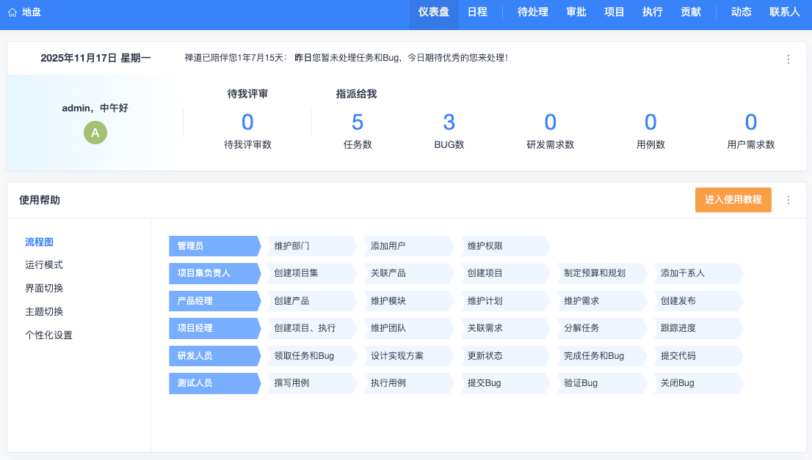
