# Website Deployment and Initialization Guide

This document provides the deployment and data initialization steps for all self-hosted websites supported by the framework. Each website uses Docker Compose for containerized deployment, ensuring environmental consistency and quick startup.

> **Note**: Please ensure Docker and Docker Compose (v2+) are installed.

---

## VeOps CMDB

### Deployment Steps

#### 1. Start Services

Navigate to the CMDB directory and start the containers:

```bash
cd {$sites}/cmdb
docker compose up -d
```

#### 2. Verify Deployment

After the containers have started, access the web interface to verify successful deployment:

- **Access Address**: `http://localhost:9903`（adjust based on actual configuration）
- **Verification Method**: Seeing the login page indicates successful deployment.

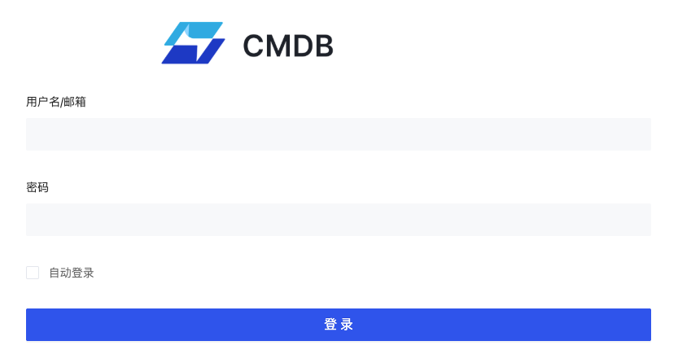

### Data Initialization

#### 1. Log in to the System

Use the default account to log in:

- **Username**: `demo`
- **Password**: `123456`

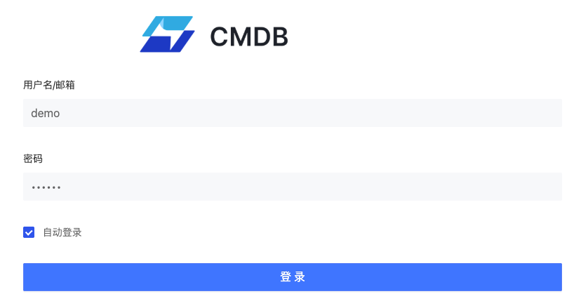

#### 2. Verify Initialization

After successful login, access the homepage to view the initialized data and confirm the system is correctly initialized:

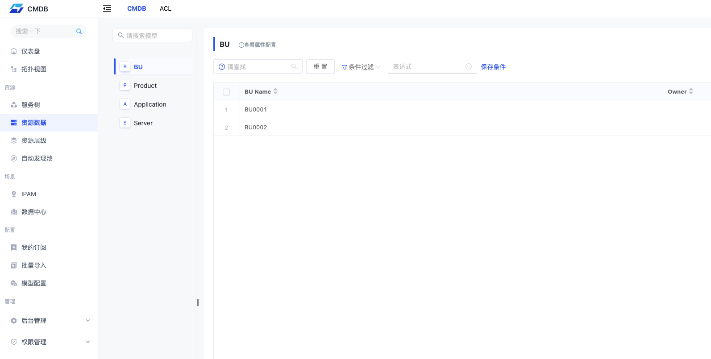

---

## iTop

### Deployment Steps

#### 1. Start Services

Navigate to the iTop directory and start the containers:

```bash
cd {$sites}/iTop
docker compose up -d
```

#### 2. Verify Deployment

After the containers have started, access the web interface to verify successful deployment:

- **Access Address**: `http://localhost:9904`（adjust based on actual configuration）
- **Verification Method**: Seeing the installation wizard page indicates successful deployment.

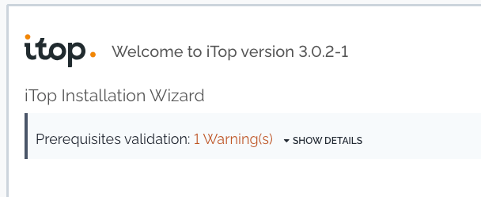

### Data Initialization

iTop needs to be initialized through the web installation wizard. Please follow the steps below:

#### 1. Start Installation

Click "Install a new iTop" to begin the installation:

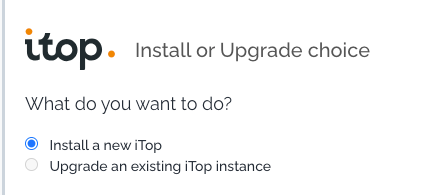

#### 2. Accept License Agreement

Read and accept the iTop license agreement:

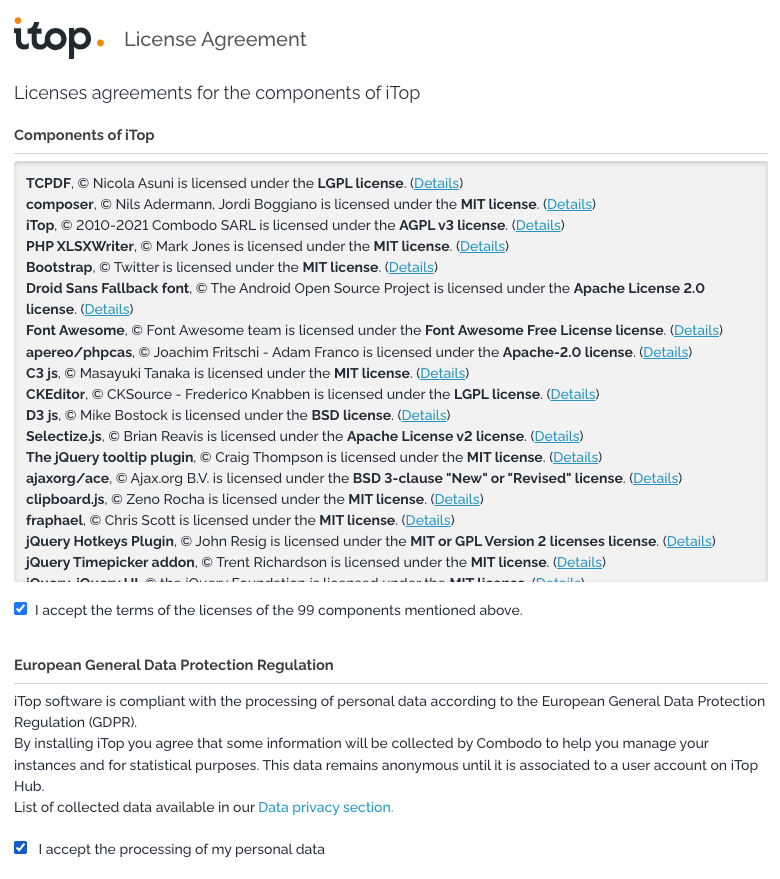

#### 3. Configure Database Connection

Fill in the database connection information:

- **Server Name**: `db`
- **Login**: `itop`
- **Password**: `It0pDbP@ss!`

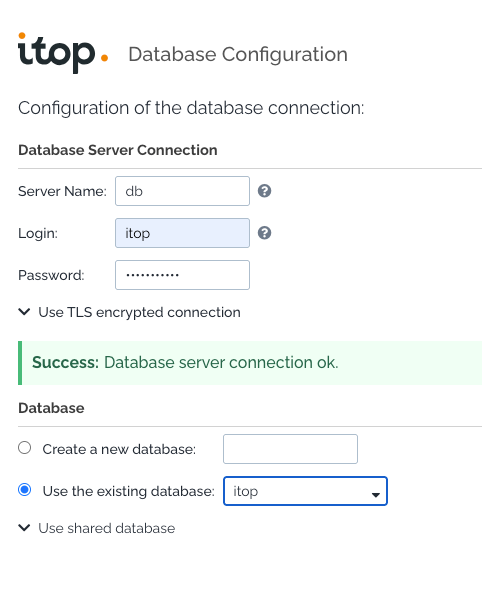

#### 4. Set Administrator Account

Set the administrator account password:

- **Password**: `admin1234`

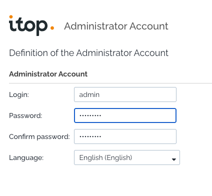

#### 5. Other Configurations

Keep the default configuration or adjust as needed:

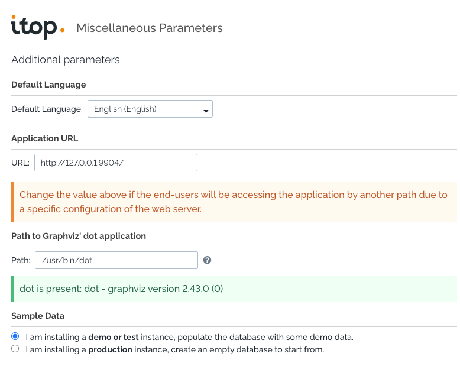

#### 6. Configuration Management Options

Select relevant functional modules for configuration management:

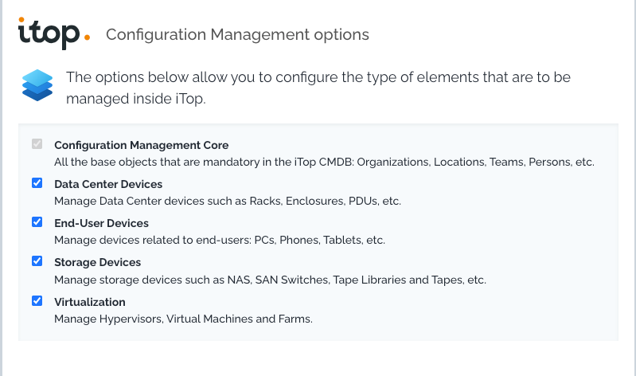

#### 7. Service Management Options

Select relevant functional modules for service management:

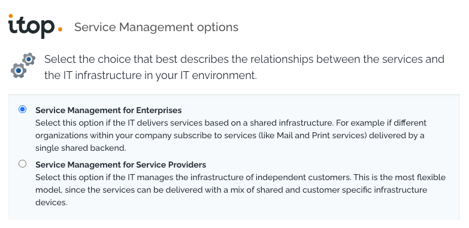

#### 8. Tickets Management Options

Select relevant functional modules for ticket management:

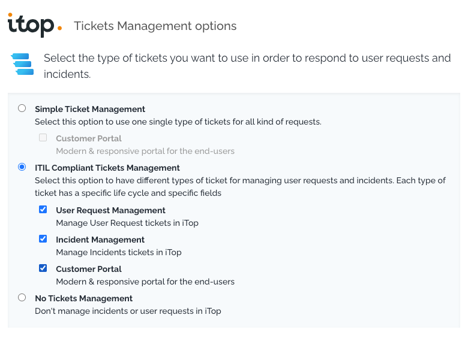

#### 9. Change Management Options

Select relevant functional modules for change management:

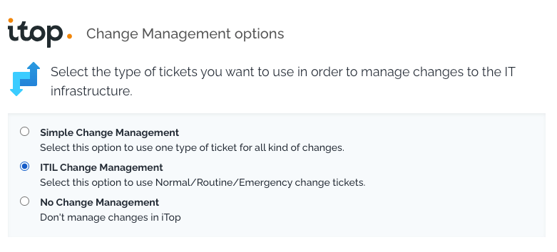

#### 10. ITIL Tickets Options

Select additional ITIL ticket functions:

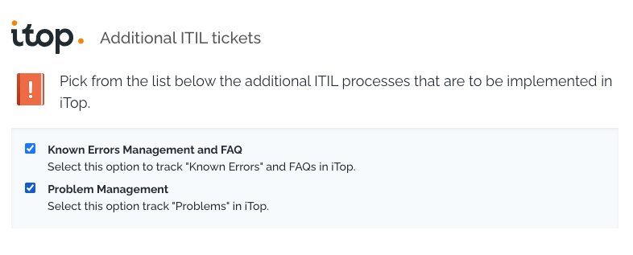

#### 11. Ready to Install

Confirm all configuration information and prepare to start the installation:

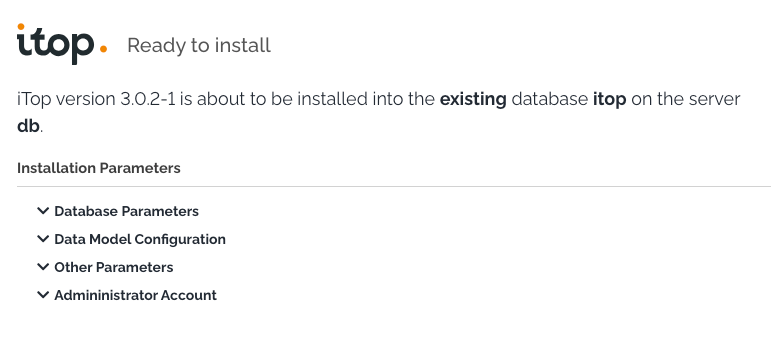

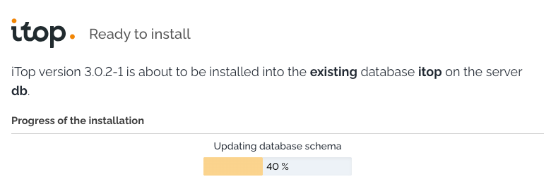

#### 12. Complete Installation

After the installation is complete, the system will display a success page:

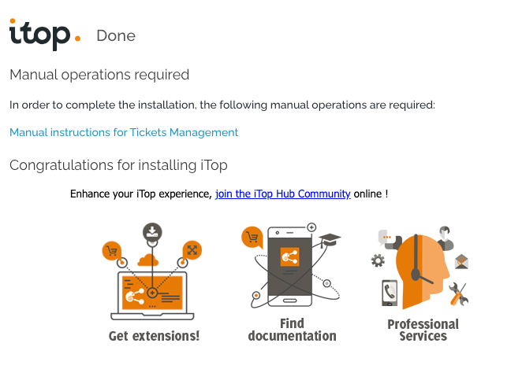

#### 13. Verify Initialization

Log in to the system using the administrator account and access the homepage to view the initialized data, confirming the system is correctly initialized:

- **Username**: `admin`
- **Password**: `admin1234`

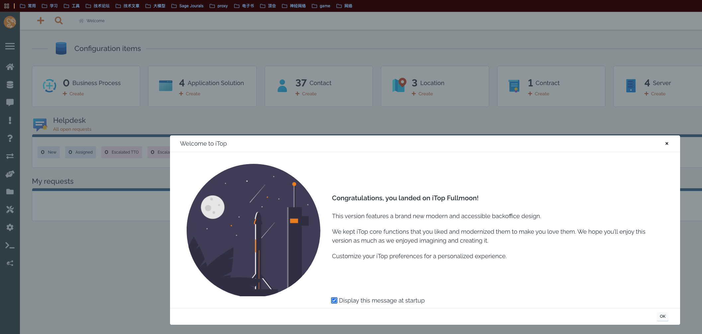

---

## OpenProject

### Deployment Steps

#### 1. Start Services

Navigate to the OpenProject directory and start the containers:

```bash
cd {$sites}/openproject
docker compose up -d
```

#### 2. Verify Deployment

After the containers have started, access the web interface to verify successful deployment:

- **Access Address**: `http://localhost:9902`（adjust based on actual configuration）
- **Verification Method**: Seeing the login page indicates successful deployment.

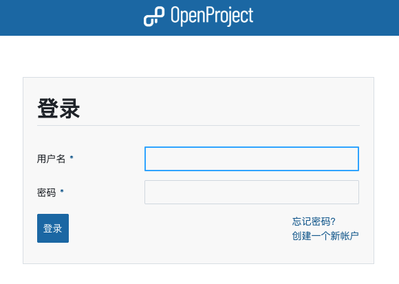

### Data Initialization

#### 1. First Login

Use the default administrator account to log in:

- **Username**: `admin`
- **Pssword**: `admin`

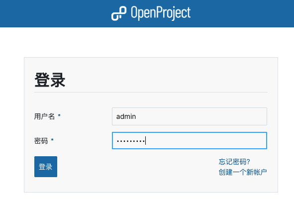

#### 2. Reset Password

After the first login, the system will require a password reset. Set a new password:

- **New Password**: `admin123456`

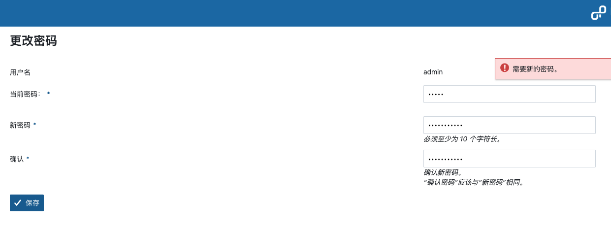

#### 3. Verify Initialization

After logging in with the new password, access the homepage to view the initialized data and confirm the system is correctly initialized:

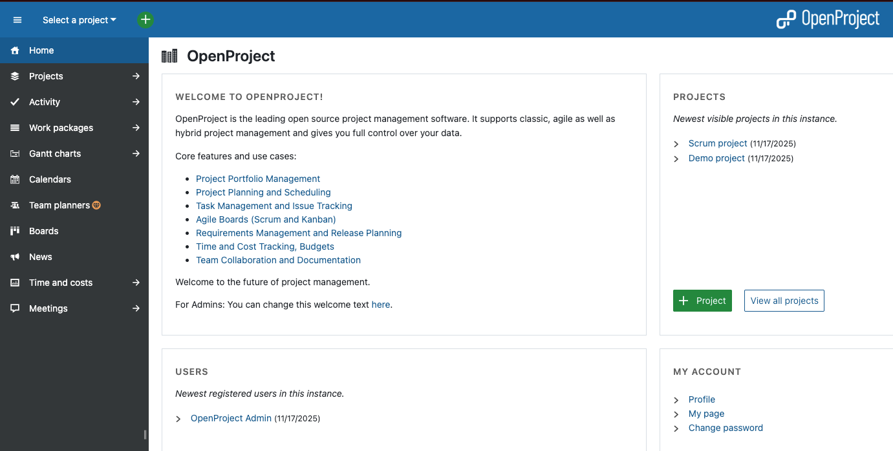

---

## ZenTao

### Deployment Steps

#### 1. Start Services

Navigate to the ZenTao directory and start the containers:

```bash
cd {$sites}/zentao
docker compose up -d
```

#### 2. Verify Deployment

After the containers have started, access the web interface to verify successful deployment:

- **Access Address**: `http://localhost:9901`（adjust based on actual configuration）
- **Verification Method**: Seeing the installation wizard page indicates successful deployment.

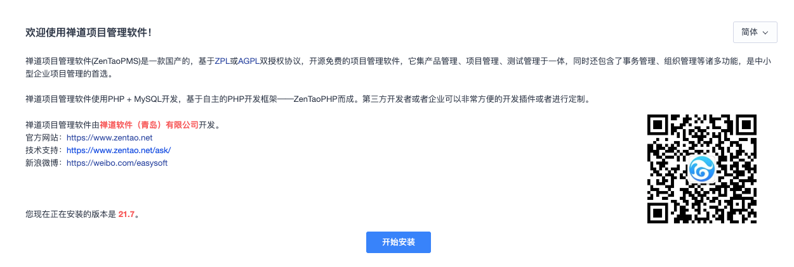

### Data Initialization

ZenTao needs to be initialized through the web installation wizard. Please follow the steps below:

#### 1. Accept License Agreement

Read and accept the ZenTao license agreement:

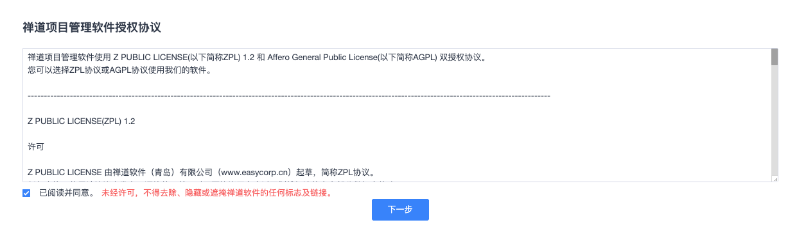

#### 2. System Check

he system will automatically check the environment configuration. Click "Next" by default to continue:

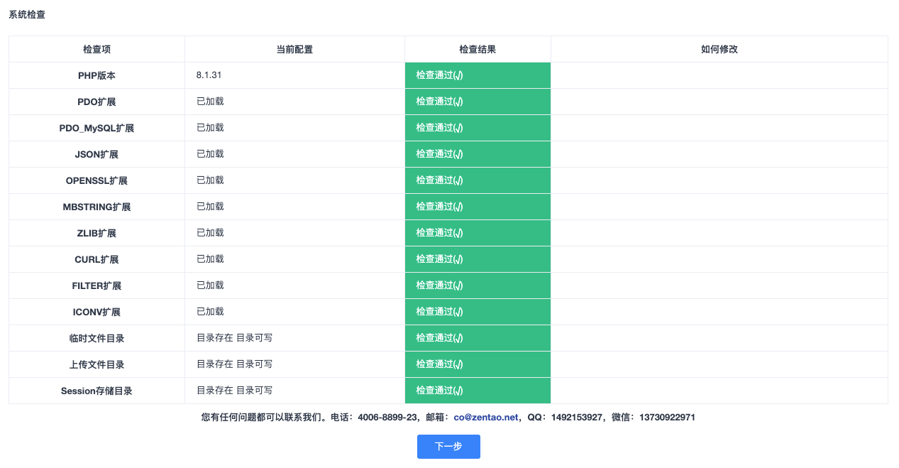

#### 3. Configuration File Check

The system will check the creation status of the configuration file. Click "Next" by default to continue:

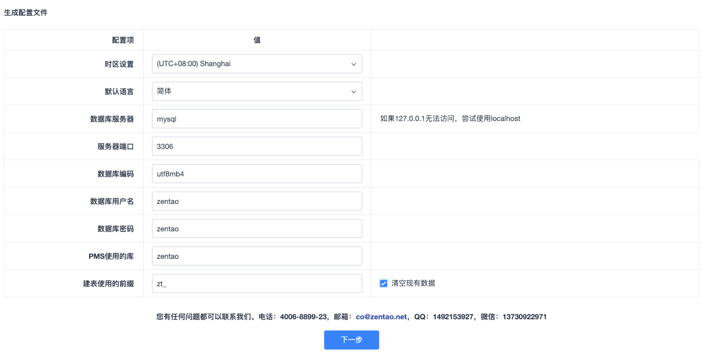

#### 4. Complete Basic Configuration

After completing the basic configuration, click "Done" to proceed to the next step:

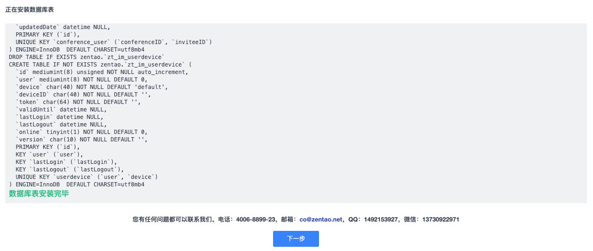

#### 5. Select Management Mode

Select "Use full lifecycle management mode":

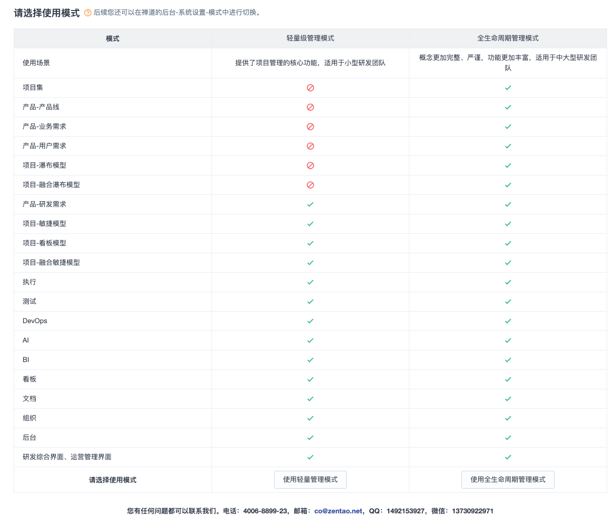

#### 6. Set Account and Import Demo Data

On the account settings page, be sure to check "Import demo data" for subsequent evaluation use:

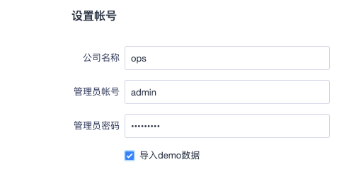

#### 7. Verify Initialization

After installation, access the homepage to view the initialized data and confirm the system is correctly initialized:

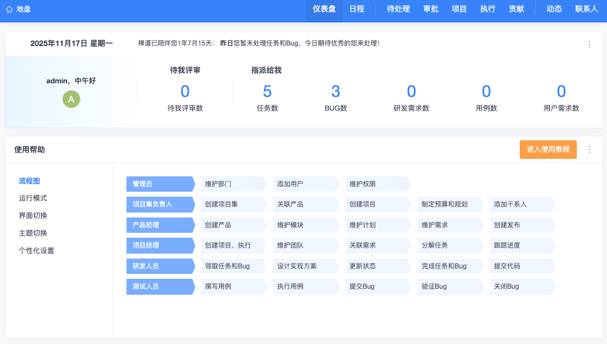
